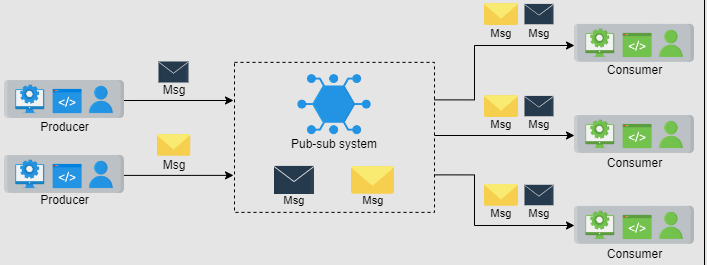

# Pub-Sub

Is an asynchronous service-to-service communication method that’s popular in serverless and microservices architectures.  
Remember in case of distributed cache Redis, we used pub-sub model so that one server can publish the invalidate key and the rest of redis servers can subscribe to it and invalidate that key at their end.

