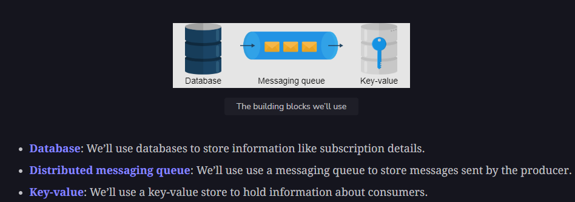

# Pub-Sub

Is an asynchronous service-to-service communication method.  


**Here it is imp to note that a publisher can publish a message from one node and subscribers from another node in a distributed system can consume the message**

## Use case

1. Replicating data: The pub-sub system can be used to distribute changes. For example, in a leader-follower protocol, the leader sends the changes to its followers via a pub-sub system.
2. Remember in case of distributed cache Redis, we used pub-sub model so that one server can publish the invalidate key and the rest of redis servers can subscribe to it and invalidate that key at their end.

### API design

1. ```create(topic_ID, topic_name)```
2. ```write(topic_ID, message)```
3. ```read(topic_ID)```
4. ```subscribe(topic_ID)```
5. ```unsubscribe(topic_ID)```
6. ```delete_topic(topic_ID)```

**building block required for Pub-sub model**  

