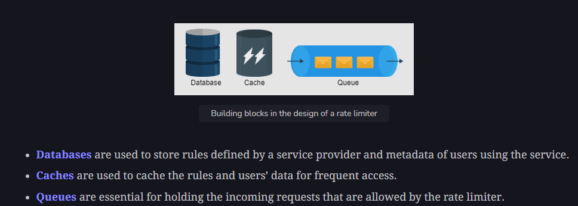

# Rate limiter

It prevents  

1. Denial of Service (DoS) attach
2. Avoid server side resource consumption
3. Can be applied at (user-based, IP-based, API-endpoint based)

**APIs to return an HTTP response code 429 Too Many Requests**

## System design of Rate limiter

### Requirements

**Functional**
1. limit the number of requests a client can send to an API within a time window
2. make the limit of requests per window configurable

**Non-functional**
1. Available
2. Low latency
3. Scalable

### 1. Rate limiter with centralized DB
Use Radis like cache, store IP and counter (no. of requests hit by IP), this way if threshold is met, give limit reached message to client.  
**Drawback** - SPOF, increase in latency if an enormous number of requests hit the centralized database

### 2. Rate limiter with distributed DB
The problem with this approach is that a client could exceed a rate limit—at least momentarily, while the state is being collected from everyone

### Building blocks used

  

**The DB is used to store rate limiting rules**

### HLD

A rate limiter can be deployed as a separate service that will interact with a web server.
AWS profides **API gateway for rate-limiting** - while configurung API gateways  
**click on "Throttling" in the Method Execution pane.**  
**Set the "Rate" and "Burst" values (burst - temporarily exceed the rate limit to burst value for a short period of time) to specify the rate limiting configuration. For example, you can set the rate to 100 requests per second and the burst to 200 requests.**

If we use Rate limites, it would increase latency -  
Each request will retrieve, update, and push back the count to the respective cache. This approach could cause latency if there is a high number of requests.

**Solution - use online / offline approach** -  
1. **Online task** - When client makes request - check the respective count. If it is less than the maximum limit proceed
2. **Offline task** - the system updates the respective count and cache offline

## Rate limiter algos

### 1. Token based algo

**tokens represent units of permission or capacity**

- **Initialization:** The token bucket is initialized with a maximum capacity (the maximum number of tokens the bucket can hold) and a refill rate (the rate at which tokens are added to the bucket).

- **Token Consumption:** When a request arrives, the system checks if there are enough tokens in the bucket to satisfy the request. If there are enough tokens, the request is allowed, and the appropriate number of tokens are consumed from the bucket. If there are not enough tokens, the request is rejected or delayed until there are enough tokens available.

- **Token Refill:** The token bucket is refilled at a constant rate over time. At each refill interval, a fixed number of tokens are added to the bucket, up to the maximum capacity.

- **Bucket Overflow:** If the bucket is already at its maximum capacity and additional tokens are added, those excess tokens are discarded. This prevents the bucket from overflowing and ensures that the rate limiting behavior is enforced.

### 2. Leaking bucket algo

- **Variant of Token Bucket:** The leaking bucket algorithm is a variant of the token bucket algorithm with slight modifications.
  
- **Bucket Analogy:** Instead of using tokens, this algorithm uses a bucket to contain incoming requests and processes them at a constant outgoing rate. It's analogous to a water bucket leaking at a constant rate.

- **Request Processing:** Requests arrive at a variable rate, but the algorithm processes them at a constant rate in a first-in-first-out (FIFO) order.

- **Constant Outgoing Rate:** Similar to the token bucket algorithm, the leaking bucket algorithm ensures a constant rate of outgoing request processing, regardless of the variable incoming request rate.

### 3. Sliding Window Rate Limiting Algo

- **Purpose:** Control the rate of incoming requests or operations over a sliding time window, ensuring that the average rate of requests within the window does not exceed a specified limit.

- **Initialization:** Initialize a sliding time window of fixed duration divided into discrete intervals or "buckets." Each bucket represents a time interval within the window.

- **Request Tracking:** Track the number of requests occurring within each bucket of the sliding window. Incoming requests are assigned to the current bucket corresponding to the current time interval.

- **Bucket Expiry:** Move the sliding window forward over time, allowing older buckets to expire and be removed. This ensures that the window only contains buckets corresponding to recent time intervals.

- **Rate Limit Enforcement:** Calculate the total number of requests within the sliding window by summing the request counts in non-expired buckets. If the total exceeds the specified rate limit, additional incoming requests are rejected or delayed.
