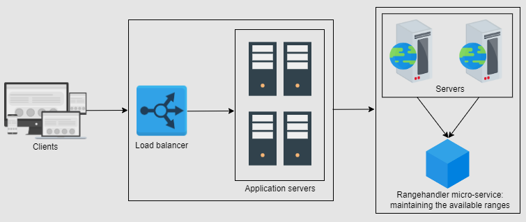

# Sequencer

Sequencer assigns unique numbers to events or messages, ensuring that the events are processed in the correct order by all nodes in the system.

In normal DB - we use auto increment for a table, but what about Distributed DB's? auto increment one 1 table will start from 1 for all the tables which are sharded.  

Hence sequencer is used. 

**Sequencer is mostly used to analyze performance based on logs to replicate user behavior** 

**FB scenario - (where all steps 3 and 4 occur concurrenty)**  

1. User A posts an update.
2. User B comments on the post.
3. User C reacts to User B's comment.
4. User D replies to User B's comment.

We need sequencer to assign unique incremental Id to each of this event, otherwise there order might break since the requests are being processed by multiple nodes.

**possible solution** - use userId and timetamp to identify the event, **issue** - clock skew between multiple nodes, **clock skew solution** - use synchronized clocks, **issue** - performance imapct in highly concurrent distributed systems. Hence sequencer is used.

### System design for Sequencer

#### Requirements

1. Unique (64 bit for large range of vals)
2. Scalable
3. Available

#### 1. Using UUID

Each server / node in distributed system to generate UUID (it is 128 bit number).  
Collision possibility - very low, but still possible  
Issue - string 128 bit no. in DB as PK in DB makes indexing slower

#### 2. Using Range handler

Here we will have range handler micro-service which will have reserved range of Ids. For e.g. it will have range of Ids from 1 to 1 Billion, then 1 Billion 1 to 2 Billion and so on.  
Each node withing thw system will request for the range, lets say node 1 gets 1 to 1 Billion range, node 2 gets 1 Billion 1 to 2 Billion rnage.  
Now Node 1 and Node 2 can incrmentallty use these ranges provided by the range handler microservice for each of it's events.  
When all the range is used up, query the microservice to get a new range of Ids

  

**Now that we used UUID to distinguish between events, we need ordering of those events to know the sequence in which events occured**

Below are some ways to get sequence of events

#### 1. Using Unix timestamp

We can have a server which will return unique timestamp and then the node can assing this timesatmp along with the ID.  
But the server which provides unique timesatmp would be Single Point Of Failure (SPOF).  
**Solution** - we can use multiple unix timestamp providers servers and can add load balancing to solve SPOF

#### 2. Twitter Snowflake

  

Here we are using 64bit UUID, so out of total 64 bits  

1. **1 sign bit** - always 0 indicating that the OD will alys be positive
2. **41 bits** for epoch timestamp (in milliscond) - these epoch time would act as uniuw identifiers
3. **10 worker bits** - each worker node within the system will have Id in bits fromat so total (1024 worker nodes)
4. **12 bit sequence** - last 12 bits will be sequence in incremental format, so toal 4096 incremental Ids, in a given millisecond. Hence in highlt concurrent distributed system, in 1 milliscond, we can handle upto 4096 req. per milliscond per worker node with unique ID generated in a sequnce, and when a req. is not hit within the same milliscond (not concrrently) we will have different epoch time 