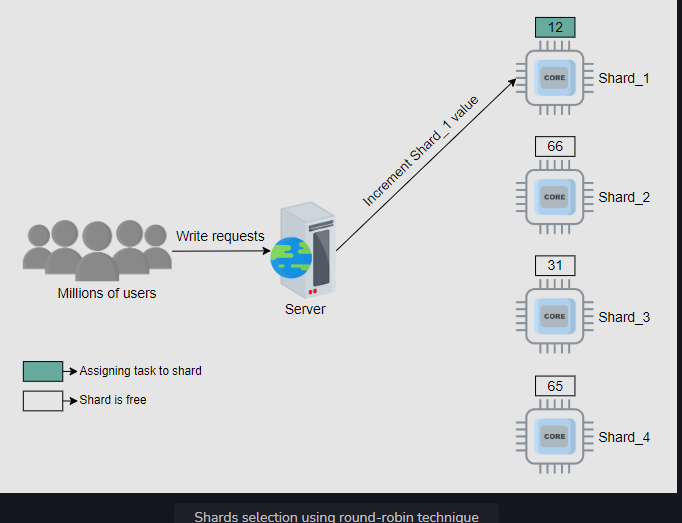

# Sharded (Distributed) Counters

**Problem** - In twitter 6000 tweets are twitted every second, now every like to t tweet is a counter and like activity is heavy hitter (most frequent activity), and for every like, if we update DB it will be very slow because there would be lot of concurrent writes to DB and write operations are slower then read and we need to acquire lock for each write. **Hence sharded counters are required**

**Same scenario of likes in youtube, fb, insta**  

## API design

1. ```createCounter(counter_id, number_of_shards)``` number of shards here need to by dynamic, if user has millions of followers, no of shard is more, less followers, less shards. Called when users tweets / creates posts
2. ```writeCounter(counter_id, action_type)``` - when increment / decremenign likes, action-type (increment, decrement). Called when users like / dislike
3. ```readCounter(counter_id)``` - when post is seen by users

When a user posts a tweet on Twitter, the \createCounter API is called.

  

**When reasding the distributed counter value** - we need to sum up the counts of each shard and display to user, now every time calling the sum of all shards will create high latency, instead periodically eady the values of all shard counters and store the sum in cache, again after some time do the sum and store in cache.  

Similarly store the periodic sum in DB  

