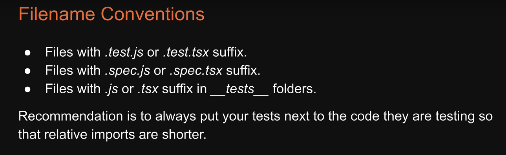
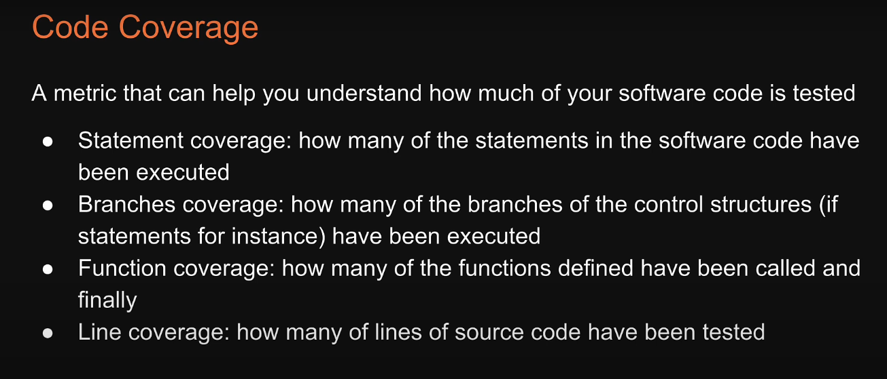
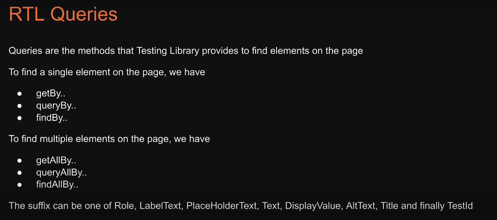
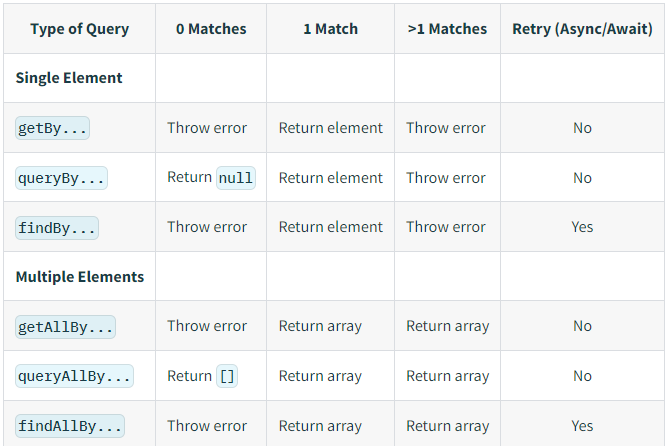
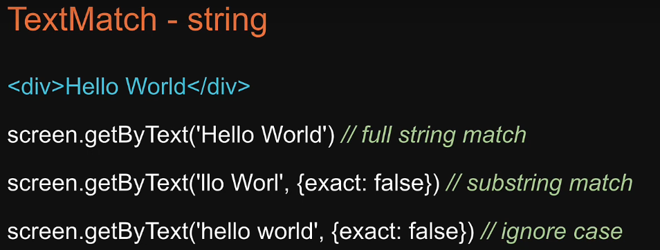
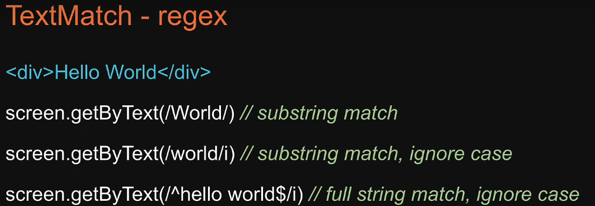
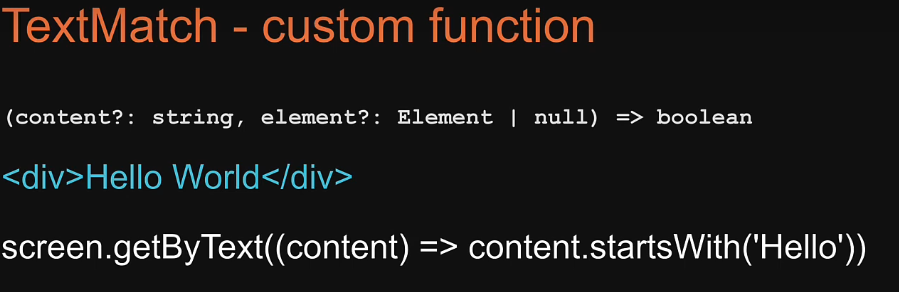

## Jest
1. **Jest** - Testing JS framework and works with node, react, angular, mocha specific to node, features(0 config, snapshots, isolated n fast, code coverage inbuilt(--coverage)), start-(1. npm i jest, "test": "jest", 2. jest --inti 3. test('1+1=2',()=>{expect(sum(1,2).toBe(3))})
2. **Matchers** - expect(funcUnderTest).(toBe(), notToBe(), toEqual()/match/contain/throw, toBeNull/undefined/falsy/GreaterThan/LT)
3. **Testing async code** - test('',()=>{return fetchData().then(data =>{expect(data).toBe('ABC')})}), return imp, **using await** - test('',async ()=>{data = await fetchData();expect(data).toBe('ABC');})
4. **Setup and Teardown** - beforeEach(() => {}, beforeAll, after, use in/outside of describe
5. **Mocking** - 2 ways, 1. create mock func - (mockCB = jest.fn(x=>42+x), expect(mockCB.mock.calls.length).toBe(1)), 2. Mocking modules - (jest.mock('axios');val = axios.get.mockResolvedValue(resp); expect(expVal).toEq(val))
6. **Snapshot testing** - renders UI comp, takes a snapshot, compares it to a reference snapshot file, test fails if snapshots don't match(either update test/snapshot), npm i --save-dev react-test-renderer (import React, import renderer from 'react-test-renderer'; it('renders correctly', () => {const tree = renderer.create(<`Link page="http://www.facebook.com"> Facebook</Link>`).toJSON();expect(tree).toMatchSnapshot();});), code review of snapshots, jest --updateSnapshot, jest --watch(ineractively update snapshot), **property matchers** - when comp renders dynamic val - renders Math.random() - (expect(tree).toMatchSnapshot({createdAt: expect.any(Date),id: expect.any(Number),});)
7. **Snapshot vs visual regression(backstop)** - sanpshot - only UI is verified, values are serialized, stored within text files, and compared using a diff algorithm.,  for logic do normal unit testing (above 1-5), visual regression - take screenshots of web pages and compare the resulting images pixel by pixel. Jest ADV - no flakiness n fast, visual regression requires real browser n diff browser render UI differently(use docker), in snapshot tests is run in cli
 
## React Testing
Testing in react is done with 2 libraries (Jest and RTL)  

1. **Jest** - it is a test runner (testing framework) - describe, test etc. function are part of this library
2. **RTL (React testing library)** - it provides a virtual DOM, that is used to verify behaviour of a component

## 1. JEST
 

```javascript
import { render, screen } from '@testing-library/react'
import { Greet } from './Greet'
//Don't need to import describe/ test
describe('Greet', () => { // describe is used to group multiple tests, for logical grouping 
  // 1 test suit = 1 test file and not 1 describe block
  test('renders correctly', () => {
    render(<Greet />) // this creates a virtual DOM for Greet component
    const textElement = screen.getByText('Hello Guest') // screen is an obj, which allows to query VDOM
    expect(textElement).toBeInTheDocument() // this matchers like toBeInTheDOM is comming from jest-dom library which is a dependent of RTL library
    // to see all custom matchers - https://github.com/testing-library/jest-dom?tab=readme-ov-file#custom-matchers
  })
  test('renders a name', () => {
    render(<Greet name="Vishwas" />)
    const textElement = screen.getByText('Hello Vishwas')
    expect(textElement).toBeInTheDocument()
  })
})

// both describe and test functions have utility (only and skip) functions
// describe.only() // test.skip()
// e.g.
describe.only("Greet", () => {})

// test function can be replaced with it functions
// no difference
it('renders correctly', () => {
})

// test.skip() would be xit() and test.only would be fit()
```

### Coverage

 

**coverage command**  

```json
// package.json
"scripts": {
  "test": "react-scripts test", // react-scripts runs the test which has jest, jest-dom installed
  "coverage": "npm run test --coverage --watchAll --collectCoverageFrom='src/components/**/*.{ts,tsx}' --collectCoverageFrom='!src/components/**/*.{type}'", 
  // run code coverage for all ts/tsx files and ignore all typescripts files

  // to setup code coverage thresholds
  "jest": {
    "coverageThreshold": {
      "global": {
        "lines": 80,
        "functions": 80,
        "branches": 80,
        "statements": -10
      }
    }
  }
  // jest will fail if less than 80% coverage for lines / branches/functions or more than 10 statements not covered

}
```

### Matchers

Besides below matchers - jest dom provides custom matchers related to virtual DOM  
[Jest-dom custom matchers](https://github.com/testing-library/jest-dom?tab=readme-ov-file#custom-matchers)

```javascript
//exact equality - value and type of obj should be same
test('two plus two is four', () => {
  expect(2 + 2).toBe(4);
});

// not to be
test('two plus two is four', () => {
  expect(2 + 2).not.toBe(5);
});

//non stric equality - here type is ignored
// only value is verified
test('object assignment', () => {
  const data = {one: 1};
  data['two'] = 2;
  expect(data).toEqual({one: 1, two: 2});
});

//other matchers
test('null', () => {
  const n = null;
  expect(n).toBeNull();
  expect(n).toBeDefined();
  expect(n).not.toBeUndefined();
  expect(n).not.toBeTruthy();
  expect(n).toBeFalsy();
});
test('zero', () => {
  const z = 0;
  expect(z).not.toBeNull();
  expect(z).toBeDefined();
  expect(z).not.toBeUndefined();
  expect(z).not.toBeTruthy();
  expect(z).toBeFalsy();
});

//for numbers
test('two plus two', () => {
  const value = 2 + 2;
  expect(value).toBeGreaterThan(3);
  expect(value).toBeGreaterThanOrEqual(3.5);
  expect(value).toBeLessThan(5);
  expect(value).toBeLessThanOrEqual(4.5);
  // toBe and toEqual are equivalent for numbers
  expect(value).toBe(4);
  expect(value).toEqual(4);
});
test('adding floating point numbers', () => {
  const value = 0.1 + 0.2;
  //expect(value).toBe(0.3);           This won't work because of rounding error
  expect(value).toBeCloseTo(0.3); // This works.
});

//for strings
test('there is no I in team', () => {
  expect('team').not.toMatch(/I/);
});
test('but there is a "stop" in Christoph', () => {
  expect('Christoph').toMatch(/stop/);
});

//arrays and iterables
const shoppingList = [
  'diapers',
  'kleenex',
  'trash bags',
  'paper towels',
  'beer',
];
test('the shopping list has beer on it', () => {
  expect(shoppingList).toContain('beer');
  expect(new Set(shoppingList)).toContain('beer');
});

//exceptions
function compileAndroidCode() {
  throw new Error('you are using the wrong JDK');
}

test('compiling android goes as expected', () => {
  expect(compileAndroidCode).toThrow();
  expect(compileAndroidCode).toThrow(Error);
  // You can also use the exact error message or a regexp
  expect(compileAndroidCode).toThrow('you are using the wrong JDK');
  expect(compileAndroidCode).toThrow(/JDK/);
});
```

### Testing asynchronous code
```javascript
// promises
test('the data is peanut butter', () => {
  return fetchData().then(data => {
    expect(data).toBe('peanut butter');
  });
});
// Be sure to return the promise - if you omit this return statement,
// your test will complete before the promise returned from fetchData

test('the fetch fails with an error', () => {
  expect.assertions(1);
  return fetchData().catch(e => expect(e).toMatch('error'));
});

//Async Await
test('the data is peanut butter', async () => {
  const data = await fetchData();
  expect(data).toBe('peanut butter');
});

test('the fetch fails with an error', async () => {
  expect.assertions(1);
  try {
    await fetchData();
  } catch (e) {
    expect(e).toMatch('error');
  }
});
```

### Setup and Teardown
```javascript
// Repeating Setup For Many Tests
beforeEach(() => {
  initializeCityDatabase();
});
afterEach(() => {
  clearCityDatabase();
});
test('city database has Vienna', () => {
  expect(isCity('Vienna')).toBeTruthy();
});
test('city database has San Juan', () => {
  expect(isCity('San Juan')).toBeTruthy();
});

// One-Time Setup
beforeAll(() => {
  return initializeCityDatabase();
});
afterAll(() => {
  return clearCityDatabase();
});
test('city database has Vienna', () => {
  expect(isCity('Vienna')).toBeTruthy();
});
test('city database has San Juan', () => {
  expect(isCity('San Juan')).toBeTruthy();
});
```
By default, the before and after blocks apply to every test in a file. You can also group tests together using a describe block. When they are inside a describe block, the before and after blocks only apply to the tests within that describe block.  

So jest also has describe  
```javascript
// Applies to all tests in this file
beforeEach(() => {
  return initializeCityDatabase();
});
test('city database has Vienna', () => {
  expect(isCity('Vienna')).toBeTruthy();
});
describe('matching cities to foods', () => {
  // Applies only to tests in this describe block
  beforeEach(() => {
    return initializeFoodDatabase();
  });
  test('Vienna <3 sausage', () => {
    expect(isValidCityFoodPair('Vienna', 'Wiener Schnitzel')).toBe(true);
  });
});
//first beforeall is run and then before each
//first aftereach is run and then afterall
```


## 2. RTL (React testing library)

### Steps to test the components
1. Render the component in virtualDOM in test env (achieved using render method from RTL)
2. Find an element renderd by the component (achieved by RTL quereis, see below)
3. Assert agains the found element (use matchers from jest + custom matchers from jest-dom library)

### 1. RTL quereis
 

 


#### 1. getByRole()
1. This query will get html elements from RTL VDOM based on role attribute from HTML tags
2. By default most html elements have default roles even if we don't add them in html tag
3. role attribute are added to help assistive technologies understand the meaning of that tag

**default html roles**

| HTML Element   | Default Role         | Possible Values            |
|----------------|----------------------|----------------------------|
| `<a>`          | `link`               | `button`, `link`           |
| `<button>`     | `button`             | `button`, `link`           |
| `<input>`      | `textbox`            | `checkbox`, `textbox`      |
| `<select>`     | `combobox`           | `listbox`, `combobox`      |
| `<textarea>`   | `textbox`            | `textbox`, `combobox`      |
| ``        | `img`                | `img`, `button`            |
| `<table>`      | `table`              | `table`, `grid`            |
| `<th>`         | `columnheader`       | `columnheader`, `rowheader`|
| `<ul>`         | `list`               | `list`, `group`            |
| `<ol>`         | `list`               | `list`, `group`            |
| `<li>`         | `listitem`           | `listitem`, `menuitem`     |
| `<nav>`        | `navigation`         | `navigation`, `group`      |
| `<header>`     | `banner`             | `banner`, `group`          |
| `<footer>`     | `contentinfo`        | `contentinfo`, `group`     |
| `<form>`       | `form`               | `form`, `search`           |

**Usage** - 

```javascript
const elem = screen.getByRole('textbox')

// we can pass optional 3rd argument
<body>
  <main aria-hidden="true">
    <button>Open dialog</button>
  </main>
  <div role="dialog">
    <button>Close dialog</button>
  </div>
</body> 

//getByRole('button') would only return the Close dialog-button. To make assertions about the Open dialog-button you would need to use 
getAllByRole('button', { hidden: true })
// other properties in options object
// name?: TextMatch,
// description?: TextMatch,
// selected?: boolean,
// checked?: boolean,
```

#### 2. getByLabelText() - This will search for the label that matches the given TextMatch  

```javascript


import {render, screen} from '@testing-library/react'
render(<Login />)
const inputNode = screen.getByLabelText('Username')
```

#### 3. getByPlaceholderText()
#### 4. getByText()
#### 5. getByAltText()
#### 6. getByTitle()
#### 6. getByTestId() - returns elements that have matching data-testid attribute

**what is data-testid attribute?** - 
1. Provide unique identifiers for testing purposes, used in unit and intergation testing to select DOM elements. 
2. Used in complex UIs to efficiently target elements
3. These attributes should not be pushed to production code
```javascript
<div data-testid="custom-element" />

import {render, screen} from '@testing-library/react'
render(<MyComponent />)
const element = screen.getByTestId('custom-element')
```
4. Removing data-testid attributes for prod
**Using bable**

```javascript
// npm install --save-dev babel-plugin-react-remove-properties
{
  "plugins": [
    ["babel-plugin-react-remove-properties", { "properties": ["data-testid"] }]
  ]
}
```

### Priority order for queries

**always use getByRole wherever possible**

| Priority | Query              | When to Use                                                     |
|----------|--------------------|-----------------------------------------------------------------|
| 1        | `getByRole`        | Use for elements with ARIA roles (e.g., button, heading, link). |
| 2        | `getByLabelText`   | Use for form elements associated with a label.                  |
| 3        | `getByPlaceholderText` | Use for input elements with placeholder text.              |
| 4        | `getByText`        | Use for elements with visible text content.                     |
| 5        | `getByDisplayValue`| Use for form elements displaying a specific value.              |
| 6        | `getByAltText`     | Use for images with alt text.                                   |
| 7        | `getByTitle`       | Use for elements with a title attribute.                        |
| 8        | `getByTestId`      | Use for elements with a `data-testid` attribute.                |

### 2. RTL text match

**In all the above query, the first argument us not a string, but it is a textMatch**  
**screen.getByRole('button')** - here 1st arg button is string, but it can be any of the three  
1. string
2. regex
3. custom function - which returns boolean

##### 1. string

 

##### 2. Regex

 

##### 3. custom function

 

### 3. RTL queryBy...() - when we want to assert that the element is not present in the VDOM
**all the above queries we saw get.., they only return an element if it is present in VDOM**  
**If we want to test if the element should not be present in the DOM?**  
**e.g. - for not logged in user we show login button, for logged in button we show logout button**  
**if we want to ensure that logout button is not present when user is not logged in, then we cannot use getBy methods**  

```javascript
// componet JSX
return (<>
    {isLoggedIn? <button>Log out</button>: <button>Log in</button>}
  </>
)

// test case to show log out button is not in DOM when user is not logged in

let elem = screen.getByRole('button', {
  name: 'Log out'
})
expect(elem).not.toBeInTheDocument() // this throws error
// cannot find accessible element button with name Log out
// instead we need to use queryByRole

let elem = screen.queryByRole('button', {
  name: 'Log out'
})
expect(elem).not.toBeInTheDocument() // this works
```


### 4. RTL findBy...() - to test async code
**usecase - when login button is cliked, api call made to backend and after 100ms user is logged in and then logout button is shown**
**if we use queryBy, then queryBy does not wait for logout button to be showed after 100ms, the test is run immediately**  
**use findBy / findAllby, which returns a promise after specified timeout (defautl timeout is 100ms)**

```javascript
// component code
function Login() {
  useEffect(() => { // simulating api call
    setTimeout(() => {
      setIsLoggedIn(true)
    }, 50)
  }, [])
  return (<>
    {isLoggedIn? <button>Log out</button>: <button>Log in</button>}
  </>
  )
}
// testing code
// if we use queryBy instead of findBy then unit test will search of logout button immediately instead of waiting for api call to complete
test('check logout button is diplayed after successful login', async () => {
  const elem = await screen.findByRole('button', {
    name: 'Log out'
  }, {
    timeout: 2000 // change default timeout of 100ms
  })
})
```

### 5. Debugging in unit test

**1. using debug()**  
```javascript
screen.debug() // this will log the snapshot of current VDOM
```

**2. logRoles()**  
```javascript
const view = render(<Greet />)
logRoles(view.container)// this will give list of all role attributes attached to each VDOM element 
```

### 6. VVIP - use Testing playground chrome extension to generate queries for testing
**Instead of generating query for each element in a unit test, install above extension and when we hover over the element, we will get the RTL query to get the element in the unit test**


## 2. user-events library
**If we want to simulate user actions in VDOM unit testing, we need to use this library**


```javascript
// ### 1. Mouse interaction
// e.g. - assume we have a counter component
// unit test code - simulating a button click which increments the count

import { render, screen } from '@testing-library/react'
import { Counter } from './Counter'
import user from '@testing-library/user-event' // import from user-event library

describe('Counter', () => {
  test('renders a count of 0', () => {
    render(<Counter />)
    const countElement = screen.getByRole('heading')
    expect(countElement).toHaveTextContent('0')
  })

  test('renders a count of 1 after clicking the increment button', async () => {
    user.setup() // need to setup the user to begin user interaction
    render(<Counter />)
    const incrementButton = screen.getByRole('button', { name: 'Increment' })
    await user.click(incrementButton) // simulate user event (click)// notice it is async
    const countElement = screen.getByRole('heading')
    expect(countElement).toHaveTextContent('1')
  })
})

// other apis from user events (specific to mouse)
// user.click()
// .dblClick()
// .hover() .unhover()

// ### 2. Keyboard interaction
// e.g. - assume we have a counter component and an input filed, and the counter is set to a value set in the input field when set button is clicked
// unit test code - simulating a keyboard type event which sets the count to a specfic value set in the input

test('rendres a count of 10 after clicking the set button', async () => {
    user.setup() // setup userevents
    render(<Counter />)
    const amountInput = screen.getByRole('spinbutton') // role for input type="number" is spinbutton
    // we don't need to rememeber the role = spin button, we need to use RTL playground chrome extension, it will give is the above query
    await user.type(amountInput, '10') // this simulates that user has typed 10 in the amountInput input field
    expect(amountInput).toHaveValue(10)
    const setButton = screen.getByRole('button', { name: 'Set' }) 
    await user.click(setButton) // when set button is cliked, asset that heading counter has value set inside the input field (which is 10)
    const countElement = screen.getByRole('heading')
    expect(countElement).toHaveTextContent('10')
  })

// test case to check the order of focus on html elements when keyboard tab is pressed
test('elements are focused in the right order', async () => {
    user.setup()
    render(<Counter />)
    const amountInput = screen.getByRole('spinbutton')
    const setButton = screen.getByRole('button', { name: 'Set' })
    const incrementButton = screen.getByRole('button', { name: 'Increment' })
    await user.tab()
    expect(incrementButton).toHaveFocus()
    await user.tab()
    expect(amountInput).toHaveFocus()
    await user.tab()
    expect(setButton).toHaveFocus()
  })

// other apis from user events (specific to keyboard)
// user.type()
// .tab()
// .clear()
```

### 2. Keyboard interaction

```javascript

```

## 3. Testing custom hooks in react
We cannot directly test custom hooks in react because 
1. custom hooks don't return any jsx, so no virtaul DOM
2. hooks can't be called outside of functional components

```javascript
// this wont work
render(useCounter)
```

Need to use renderHook function instead of the defaul render function

```javascript
// hook code
import { useState } from 'react'
import { UseCounterProps } from './userCouner.types'
export const useCounter = ({ initialCount = 0 }: UseCounterProps = {}) => {
  const [count, setCount] = useState(initialCount)
  const increment = () => setCount(count + 1)
  const decrement = () => setCount(count - 1)
  return { count, increment, decrement }
}

// unit test
import { renderHook, act } from '@testing-library/react'
import { useCounter } from './useCounter'
describe('useCounter', () => {
  test('should render the initial count', () => {
    const { result } = renderHook(useCounter) // notice we need to use renderHook
    // this returns result object, which has current property which has all the return values from custom hook
    expect(result.current.count).toBe(0)
  })
  test('should accept and render the same initial count', () => {
    const { result } = renderHook(useCounter, {// in the second arg, we can pass the initialProps to the customhook
      initialProps: { initialCount: 10 },
    })
    expect(result.current.count).toBe(10)
  })
  test('should increment the count', () => {
    const { result } = renderHook(useCounter)
    act(() => result.current.increment())
    expect(result.current.count).toBe(1)
  })
  test('should decrement the count', () => {
    const { result } = renderHook(useCounter)
    act(() => result.current.decrement())
    expect(result.current.count).toBe(-1)
  })
})

```

## Snapshot testing
A typical snapshot test case renders a UI component, takes a snapshot, then compares it to a reference snapshot file stored alongside the test. The test will fail if the two snapshots do not match: either the change is unexpected, or the reference snapshot needs to be updated to the new version of the UI component.  
npm i --save-dev react-test-renderer
```javascript
// e.g. 
import React from 'react';
import renderer from 'react-test-renderer';
import Link from '../Link.react';
it('renders correctly', () => {
  const tree = renderer
    .create(<Link page="http://www.facebook.com">Facebook</Link>)
    .toJSON();
  expect(tree).toMatchSnapshot();
});
/// The first time this test is run, 
// Jest creates a snapshot file that looks like this:
exports[`renders correctly 1`] = `
<a
  className="normal"
  href="http://www.facebook.com"
  onMouseEnter={[Function]}
  onMouseLeave={[Function]}
>
  Facebook
</a>`;
```
The snapshot artifact should be committed alongside code changes, and reviewed as part of your code review process  
To update snapshots - jest --updateSnapshot or jest -u  
Failed snapshots can also be updated interactively in watch mode (--watch):  
From here you can choose to update that snapshot or skip to the next:  

**property matchers**  
Often there are fields in the object you want to snapshot which are generated (like IDs and Dates). If you try to snapshot these objects, they will force the snapshot to fail on every run:
```javascript
it('will fail every time', () => {
  const user = {
    createdAt: new Date(),
    id: Math.floor(Math.random() * 20),
    name: 'LeBron James',
  };
  expect(user).toMatchSnapshot();
})
//solution - use matchers
//matchers are checked before the snapshot is written or tested,
//and then saved to the snapshot file instead of the received value:
it('will check the matchers and pass', () => {
  const user = {
    createdAt: new Date(),
    id: Math.floor(Math.random() * 20),
    name: 'LeBron James',
  };
  expect(user).toMatchSnapshot({
    createdAt: expect.any(Date),
    id: expect.any(Number),
  });
});
//Any given value that is not a matcher will be
//checked exactly and saved to the snapshot:
```

#### When to use snapshot testing
1. Snapshot tests are a complement for conventional tests not a replacement  
In normal unit test, app's functionality is verified, in snapshots only UI is verified. So use both unit testing and snapshot testing. (consider snapshot as UI testing)  

#### Snapshot vs visual regression testing
Visual regression testing tools take screenshots of web pages and compare the resulting images pixel by pixel.  
With Snapshot testing values are serialized, stored within text files, and compared using a diff algorithm.  
**Jest adv. over regression**
1. No flakiness and fast  
Because tests are run in a command line runner instead of a real browser, the test runner doesn't have to wait for builds, spawn browsers, load a page and drive the UI to get a component. Also diff. browsers will render UI in different way, then we have to use docker. (in case od BakstopJS)

